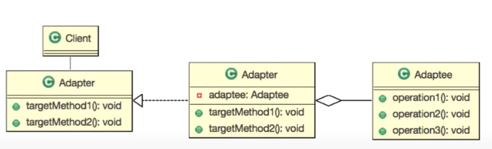
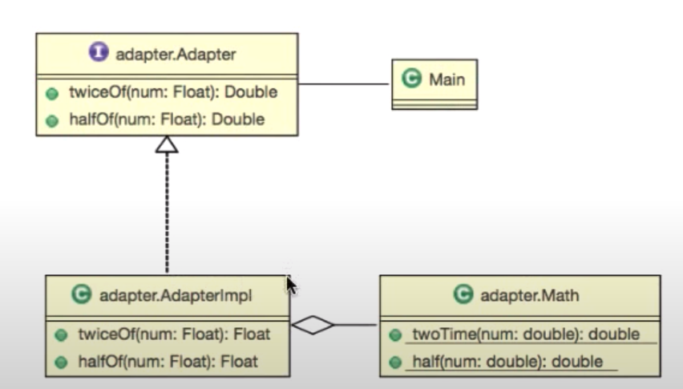

# :book: Gof Design Pattern Study

## :pushpin: Adapter Pattern (연관성 없는 두 객체 묶어 사용하기)

### 사전적 의미의 Adapter란?

- 기계, 기구 등을 다목적으로 사용하기 위한 부가 기

### 기본 설계

### 요구사항

- 두 수에 대한 다음 연산을 수행하는 객체를 만들어주세요
    - 수의 두 배의 수를 반환: twiceOf(Float): Float
    - 수의 반(1/2)의 수를 반환: halfOf(Float): Float
    
- 구현 객체 이름은 'Adapter'으로 해주세요.
- Math 클래스에서 두 배와 절반을 구하는 함수는 이미 구현되어 있습니다. 

### 요구사항 설계

### 요구사항 변경

- 알고리즘 변경을 원합니다.
    - Math 클래스에 새롭게 두 배를 구할 수 있는 함수가 추가되었습니다. 새로 구현된 알고리즘을 이용하도록 프로그램을 수정해주세요.
- 절반을 구하는 기능에서 로그를 찍는 기능을 추가해주시기 바랍니다. 