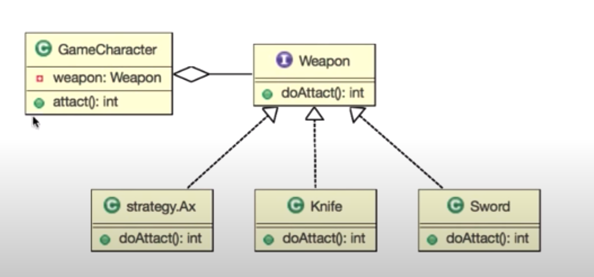

# :book: Gof Design Pattern Study

## :pushpin: Strategy Pattern (전략 바꾸기)

### Goal

- 인터페이스 개념을 이해한다.
- 델리게이트 개념을 이해한다.
- 전략 패턴 개념을 이해한다.

### 인터페이스

- 사전적 의미: 키보드나 디스플레이 따위처럼 사람과 컴퓨터를 연결하는 장치
- 기능에 대한 선언과 구현 분리
- 기능을 사용할 수 있는 통로

### 델리게이트

- **위임**하다
- 특정 객체의 기능을 사용하기 위해 다른 객체의 기능을 호출하는 것

### 스트레티지 패턴

- 여러 알고리즘을 하나의 추상적인 접근점(인터페이스)을 만들어 접근 점에서 서로 **교환 가능**하도록 하는 패턴

### 요구사항

- 신작 게임에서 캐릭터와 무기를 구현해보세요.

- 무기는 두가지 종류가 있습니다.
    - 칼 
    - 검 
    
    
### 유지 보수 요청

- 무기 중에 도끼를 추가해주세요.

### Class Diagram

